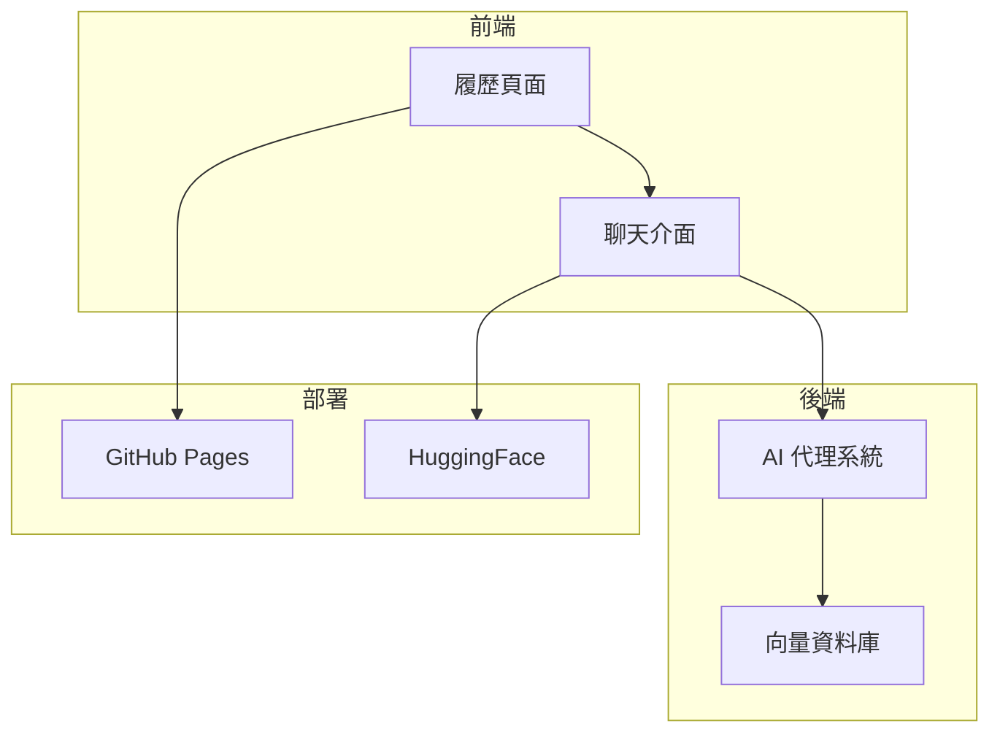
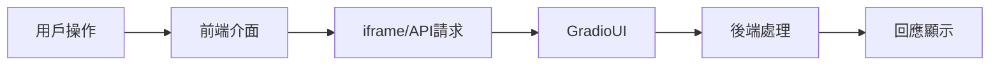
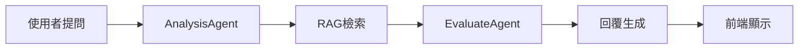
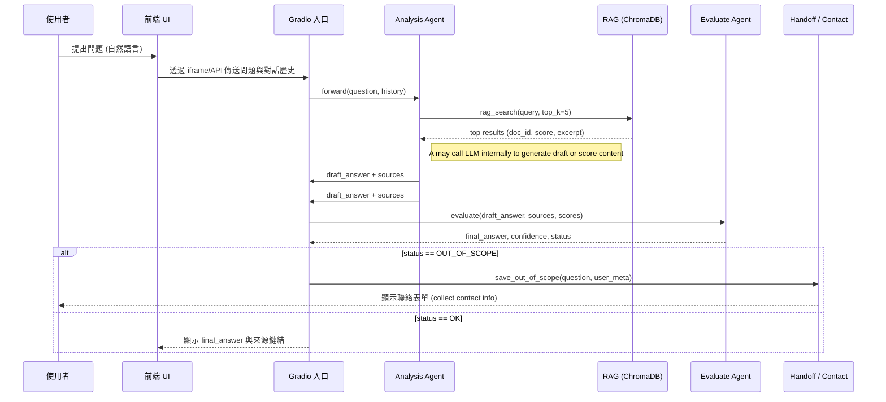

# ResumeMate 開發計劃

## 1. 專案概述

ResumeMate 是一個 AI 驅動的履歷代理人平台，結合靜態履歷展示與 AI 互動問答功能。

### 核心特色

- **智慧問答**：透過 RAG 技術實現個人化的履歷內容對話
- **雙語支援**：中英文介面無縫切換
- **簡潔展示**：清晰呈現個人資料、經歷與專長

### 系統架構



### 技術架構

- **前端**：HTML + Tailwind CSS，響應式設計
- **後端**：Python + Gradio + OpenAI SDK
- **資料庫**：ChromaDB 向量資料庫
- **部署**：GitHub Pages + HuggingFace Spaces

---

## 2. 開發里程碑

### 第一階段：基礎建置 (2週)

#### 📍 檢視點 1-1：環境就緒度確認 (週末)

- [x] 需求分析與規劃
  - [x] 使用案例定義
  - [x] 技術架構確認
  - [x] 開發時程安排
- [ ] 環境建置
  - [x] 向量資料庫初始化
  - [ ] 開發環境設定
  - [ ] CI/CD 基礎配置

**檢視重點**：

- 向量資料庫可用性測試
- 開發環境完整性確認
- CI/CD 流程驗證
- 專案結構評估

**交付項目**：

- 環境建置文件
- 初始化資料集報告
- CI/CD 配置文件
- 開發規範文件

### 第二階段：核心功能開發 (3週)

#### 第一次檢視點：Analysis Agent MVP (1週)

- [ ] 後端核心功能第一階段
  - [ ] Analysis Agent 基礎實作
    - RAG 檢索整合
    - 基礎回答生成
    - 向量檢索效果驗證
  - [ ] 測試與驗證
    - 單元測試覆蓋
    - 回應時間基準測試
    - 回答品質評估

⚡️ **第一次檢視重點**：

- RAG 檢索準確度評估
- 基礎問答功能驗證
- 系統回應時間測量
- 資源使用情況評估

#### 📍 檢視點 2-2：前端基礎與 Evaluate Agent (週末)

- [ ] Evaluate Agent MVP 實作 (1週)
  - 回答品質驗證
  - 異常處理機制
  - 整合測試驗證
- [ ] 前端基礎建置 (1週)
  - [ ] 靜態履歷頁面
    - HTML 結構建立
    - 基礎樣式套用
    - RWD 基礎架構
    - JSON 資料結構設計
    - 動態載入機制實作
  - [ ] 基礎聊天介面
    - UI 元件開發
    - iframe 整合測試

**檢視重點**：

- Evaluate Agent 評估效果
- 前端基礎功能可用性
- 後端整合測試結果
- 初步使用者體驗評估

**交付項目**：

- 完整功能展示
- 整合測試報告
- 前端效能報告
- API 文件初稿

### 第三階段：功能完善 (2週)

#### 📍 檢視點 3：功能完整性驗證 (週末)

- [ ] 後端功能強化
  - [ ] AI 能力提升
    - 提示詞優化
    - 回答品質改善
  - [ ] 效能優化
    - 查詢效率提升
    - 回應時間優化
- [ ] 前端優化
  - [ ] UI/UX 改善
    - 響應式優化
    - 互動效果完善
  - [ ] 多語言支援
    - 介面翻譯
    - 切換機制實作

**檢視重點**：

- AI 回答品質提升度量
- 系統效能改善指標
- 使用者體驗評估
- 多語言功能完整性

**交付項目**：

- 效能優化報告
- 使用者測試報告
- 系統監控儀表板
- 多語言支援文件

### 第四階段：整合與測試 (2週)

#### 📍 檢視點 4：系統整合驗收 (週末)

- [ ] 整合測試
  - [ ] 前後端整合測試
    - API 介接驗證
    - 錯誤處理測試
  - [ ] 效能測試
    - 負載測試
    - 回應時間測試
- [ ] 使用者測試
  - [ ] 內部測試與回饋
  - [ ] 問題修復與優化
  - [ ] 文件撰寫

**檢視重點**：

- 系統整合完整性
- 效能測試結果分析
- 使用者反饋彙總
- 問題追蹤與解決進度

**交付項目**：

- 整合測試報告
- 效能測試數據
- 使用者反饋總結
- 問題修復清單

### 第五階段：部署上線 (1週)

#### 📍 檢視點 5：上線準備度確認 (上線前)

- [ ] 正式部署
  - [ ] 前端部署 (GitHub Pages)
  - [ ] 後端部署 (HuggingFace)
  - [ ] 資料庫遷移
- [ ] 營運準備
  - [ ] 監控系統建置
  - [ ] 錯誤追蹤設定
  - [ ] 效能監控配置

**檢視重點**：

- 部署環境就緒狀態
- 監控系統可用性
- 系統效能基準
- 應急預案完整性

**交付項目**：

- 部署清單與確認表
- 監控儀表板展示
- 運維手冊
- 災難恢復計劃

### 測試策略整合

每個階段的測試重點：

1. **第一階段**
   - 環境整合測試
   - 資料庫連接測試

2. **第二階段**
   - 單元測試（重點）
   - 元件整合測試
   - API 端點測試

3. **第三階段**
   - 功能測試
   - 效能基準測試
   - 使用者體驗測試

4. **第四階段**
   - 完整整合測試
   - 系統測試
   - 壓力測試

5. **第五階段**
   - 部署測試
   - 監控測試
   - 災難恢復測試

---

## 3. 技術堆疊詳細說明

### 3.1 前端技術

| 技術/工具 | 用途 | 版本 |
|----------|------|------|
| HTML5 | 網頁結構 | - |
| CSS3 | 樣式設計 | - |
| Tailwind CSS | CSS 框架 | 最新版 |
| JavaScript | 互動邏輯 | ES6+ |
| Responsive Design | 多裝置適配 | - |
| Web Storage API | 本地儲存 | - |

### 3.2 後端技術

| 技術/工具 | 用途 | 版本 |
|----------|------|------|
| Python | 後端開發語言 | 3.10+ |
| Gradio | UI 框架 | 4.0+ |
| OpenAI API | LLM 服務 | gpt-4o-mini |
| LangChain | 大語言模型框架 | 最新版 |
| ChromaDB | 向量資料庫 | 0.4+ |
| OpenAI Agent SDK | AI 代理人開發 | 最新版 |

### 3.3 部署與運維

| 技術/工具 | 用途 | 版本 |
|----------|------|------|
| GitHub Pages | 靜態網站託管 | - |
| Hugging Face Spaces | AI 應用託管 | - |
| GitHub Actions | CI/CD | - |
| Custom Domain | 自定義域名 | brianhan.cc |

---

## 4. 前端開發計劃

### 4.1 頁面結構與資料管理

基於 [prototype.html](prototype.html) 設計，採用 JSON 驅動的內容管理方式：

#### 頁面區塊

- **Header**：導航欄與語言切換
- **Hero Section**：個人簡介與標題
- **About Me**：詳細自我介紹
- **Experience & Education**：工作與學術經歷
- **Skills**：專業技能展示
- **AI Q&A**：AI 互動問答區塊
- **Footer**：版權資訊與聯絡方式

#### 資料結構設計

```json
{
  "version": "1.0.0",
  "lastUpdated": "2025-08-26",
  "language": "zh-TW",
  "profile": {
    "name": "姓名",
    "title": "職稱",
    "summary": "簡介內容"
  },
  "experiences": [
    {
      "id": "exp-1",
      "company": "公司名稱",
      "title": "職稱",
      "period": "2023-2025",
      "description": "工作描述",
      "achievements": ["成就1", "成就2"]
    }
  ],
  "education": [
    {
      "id": "edu-1",
      "school": "學校名稱",
      "degree": "學位",
      "major": "主修",
      "period": "2018-2022"
    }
  ],
  "skills": {
    "technical": ["技能1", "技能2"],
    "soft": ["軟實力1", "軟實力2"],
    "languages": ["語言能力1", "語言能力2"]
  }
}
```

#### 動態更新機制

1. **JSON 檔案存放**：

   ```
   /data/
     ├── resume-zh.json    # 中文履歷資料
     ├── resume-en.json    # 英文履歷資料
     └── version.json      # 版本控制資訊
   ```

2. **更新流程**：
   - 修改相應的 JSON 檔案
   - 提交至 GitHub repository
   - GitHub Actions 自動部署到 GitHub Pages

3. **前端載入程式**：

   ```javascript
   async function loadResumeData(lang = 'zh-TW') {
     try {
       // 先檢查版本
       const version = await fetch('/data/version.json');
       const versionData = await version.json();

       // 載入對應語言的履歷資料
       const response = await fetch(`/data/resume-${lang}.json`);
       const data = await response.json();

       // 更新頁面內容
       updatePageContent(data);

       // 儲存版本資訊到 localStorage
       localStorage.setItem('resumeVersion', versionData.version);
     } catch (error) {
       console.error('Failed to load resume data:', error);
     }
   }

   // 定期檢查更新（每小時）
   setInterval(async () => {
     const version = await fetch('/data/version.json');
     const versionData = await version.json();
     const currentVersion = localStorage.getItem('resumeVersion');

     if (versionData.version !== currentVersion) {
       loadResumeData(document.documentElement.lang);
     }
   }, 3600000);
   ```

### 4.2 開發任務

1. **基礎結構優化**
   - 重構 HTML 結構，提升語義化
   - 優化 CSS 組織，採用模組化方式
   - 改進 JavaScript 架構，採用更現代的模式

2. **響應式設計完善**
   - 優化移動端體驗
   - 確保各種螢幕尺寸的適配性
   - 測試多種裝置與瀏覽器

3. **聊天介面整合**
   - 實作 iframe 嵌入機制
   - 處理跨域問題
   - 設計聊天介面的響應式樣式

4. **互動效果強化**
   - 優化滾動動畫
   - 新增頁面轉場效果
   - 改進懸浮與點擊反饋

5. **多語言支援完善**
   - 實作更完整的語言切換機制
   - 確保所有內容元素支援雙語
   - 優化語言切換的用戶體驗

### 4.3 前端資料流



---

## 5. 後端開發計劃

### 5.1 系統架構

採用 OpenAI Agent SDK 結合 RAG 系統，後端架構如下：



### 5.2 AI 代理人設計

本節提供可直接用於 OpenAI Agent SDK 的代理人設定草案，包含數據模型定義、代理人描述、系統指令、可用工具、交互協定與錯誤處理說明。

#### 共用數據模型（Pydantic Models）

```python
from pydantic import BaseModel, Field
from typing import List, Optional, Literal, Dict, Union
from datetime import datetime
import enum

class QuestionType(str, enum.Enum):
    FACT = "fact"              # 事實查詢
    SKILL = "skill"            # 技能相關
    EXPERIENCE = "experience"  # 經歷相關
    CONTACT = "contact"        # 聯絡相關
    OTHER = "other"           # 其他類型

class SearchResult(BaseModel):
    doc_id: str = Field(..., description="文件唯一識別碼")
    score: float = Field(..., ge=0, le=1, description="相關性分數")
    excerpt: str = Field(..., description="檢索片段內容")
    metadata: Dict = Field(default_factory=dict, description="額外元數據")

class AgentDecision(str, enum.Enum):
    RETRIEVE = "retrieve"      # 需要檢索資訊
    OUT_OF_SCOPE = "oos"      # 超出範圍
    ASK_CLARIFY = "clarify"   # 需要澄清
    NEEDS_EDIT = "needs_edit" # 需要編輯

class Question(BaseModel):
    text: str = Field(..., description="原始問題文本")
    type: QuestionType = Field(..., description="問題類型")
    timestamp: datetime = Field(default_factory=datetime.now)
    language: Literal["zh-TW", "en"] = Field(..., description="問題語言")
    context: Optional[List[str]] = Field(default=None, description="上下文對話歷史")

class AnalysisResult(BaseModel):
    query: str = Field(..., description="優化後的檢索查詢")
    question_type: QuestionType = Field(..., description="識別的問題類型")
    decision: AgentDecision = Field(..., description="代理人決策")
    confidence: float = Field(..., ge=0, le=1, description="信心分數")
    retrievals: Optional[List[SearchResult]] = None
    draft_answer: Optional[str] = None
    metadata: Dict = Field(default_factory=dict)

class EvaluationResult(BaseModel):
    final_answer: str = Field(..., description="最終回答內容")
    sources: List[str] = Field(..., description="來源文件ID列表")
    confidence: float = Field(..., ge=0, le=1, description="信心分數")
    status: AgentDecision = Field(..., description="評估狀態")
    suggestions: Optional[List[str]] = None
    metadata: Dict = Field(default_factory=dict)

class OutOfScopeRecord(BaseModel):
    question_id: str = Field(..., description="問題唯一識別碼")
    question: Question
    user_meta: Dict = Field(..., description="使用者相關資訊")
    timestamp: datetime = Field(default_factory=datetime.now)
    status: Literal["pending", "contacted", "resolved"] = "pending"

class SystemResponse(BaseModel):
    answer: str = Field(..., description="回答內容")
    sources: List[str] = Field(..., description="來源參考")
    confidence: float = Field(..., ge=0, le=1, description="系統信心分數")
    action: Optional[str] = None  # 例如："請填寫聯絡表單"
    metadata: Dict = Field(default_factory=dict)
```

#### 互動序列圖 (sequence)



#### 代理人交互協定

系統入口點：

```python
async def process_question(question: Question) -> SystemResponse:
    """主要處理流程，協調不同代理人的互動"""
    analysis = await analysis_agent.analyze(question)

    if analysis.decision == AgentDecision.OUT_OF_SCOPE:
        return handle_out_of_scope(question, analysis)

    if analysis.decision == AgentDecision.ASK_CLARIFY:
        return request_clarification(question, analysis)

    evaluation = await evaluate_agent.evaluate(analysis)

    if evaluation.status == AgentDecision.NEEDS_EDIT:
        analysis = await analysis_agent.revise(analysis, evaluation.suggestions)
        evaluation = await evaluate_agent.evaluate(analysis)

    return format_system_response(evaluation)
```

錯誤處理機制：

```python
class AgentError(Exception):
    """代理人錯誤基類"""
    def __init__(self, message: str, agent: str, error_code: str):
        self.message = message
        self.agent = agent
        self.error_code = error_code
        super().__init__(self.message)

async def handle_agent_error(error: AgentError) -> SystemResponse:
    """統一的錯誤處理邏輯"""
    await log_error(error)
    if isinstance(error, RetrievalError):
        return create_retrieval_error_response()
    elif isinstance(error, LLMError):
        return create_llm_error_response()
    return create_generic_error_response()
```

狀態追蹤：

```python
class ConversationState(BaseModel):
    """對話狀態追蹤"""
    conversation_id: str
    question_history: List[Question]
    current_question: Question
    analysis_results: List[AnalysisResult]
    evaluation_results: List[EvaluationResult]
    metadata: Dict = Field(default_factory=dict)
```

---

#### Analysis Agent

- Description：解析使用者問題、辨識問題類型（事實查詢、技能詢問、時間/地點、聯絡請求等）、決定檢索策略與要呼叫的 tools。
- System instructions（範例）：
  - 以簡潔步驟計畫回應：先判斷是否與履歷內容直接相關；若相關，產生檢索 query 與檢索參數；若不相關或無法回答，標記為 out_of_scope 並觸發 handoff。
  - 優先使用精確檢索（精簡 query + top_k=5），然後擴大檢索範圍。
  - 輸出必須遵守代理人合約的 JSON schema。
  - 使用 LLM 指導的提示詞整理檢索結果，建議採用下列 prompt pattern（範例）來生成草稿：
    - 摘要提示："Summarize the following passages into a concise answer (max 120 words),
      highlight the facts that directly answer the question and include source ids: \n{{RETRIEVALS}}"
    - 提取要點："Extract 1-3 bullet points that directly respond to the question, each with a short evidence note and source id: \n{{RETRIEVALS}}"
    - 風格/語氣調整："Rewrite the answer to be professional, concise, and friendly for a recruiter audience (Chinese/English as requested)."
- Tools（建議清單與範例簽名）：
  - rag_search(query: str, top_k: int=5) -> List[SearchResult]
  - get_document(doc_id: str) -> {id, text, metadata}
  - format_prompt(template_name: str, variables: dict) -> str
    - Description: apply a named prompt template (see `prompt_templates` below) and return a ready-to-send prompt string. This separates prompt construction from execution.
  - save_telemetry(event: dict) -> bool
- Inputs / Outputs：
  - Input: { question, history }
  - Output: { query, tool_calls: [ {name, args} ], decision: one_of([RETRIEVE, OUT_OF_SCOPE, ASK_CLARIFY]) }
- Handoff 條件：
  - 當相關性閾值低於設定（例如 top result similarity < 0.15）或辨識為私人/敏感資訊時，標記 OUT_OF_SCOPE 並要求聯絡資訊。
- Edge cases & 錯誤處理：
  - 若 rag_search 回傳空結果，回傳 decision=OUT_OF_SCOPE 並執行 save_telemetry。
  - 若 get_document 失敗（I/O 錯誤），retry 2 次，仍失敗則回傳 error code。

---

#### RAG 系統（工具層）

- Description：對接本地 ChromaDB，負責文本分段、向量檢索、結果整理與簡短摘要。作為 agent 可呼叫的工具集合實作。
- 提供的 Tools 範例：
  - rag_search(query: str, top_k: int=5) -> List[{doc_id, score, excerpt}]
    - 驗證：若 query 為空，回傳空陣列並記錄警告。
  - get_document(doc_id: str) -> {id, text, metadata}
  - summarize_text(text: str, max_tokens: int=120) -> str
  - rebuild_index(path: str) -> {status, details}
- 行為與注意事項：
  - 使用一致的 embedding model 與向量正規化方法
  - 對每次檢索結果回傳 score，用於 Evaluate Agent 判斷信心

---

#### Evaluate Agent

- Description：接收 Analysis Agent 的檢索結果與初始回答草稿，執行回答品質檢查（事實性、涵蓋度、語氣適切性），並返回最終回覆或建議修改。
- System instructions（範例）：
  - 優先確認檢索來源是否支持回答中的主張；對於每個主張，嘗試匹配至少一個來源片段。
  - 若回答缺乏來源或與來源不符，標記為 NEEDS_EDIT 並回傳修改建議或替代 phrasing。
  - 對於低信心回答（confidence < 0.3），附上超出範圍提示與聯絡表單引導。
  - 使用 LLM 指導的提示詞對草稿進行驗證與潤飾，建議 prompt pattern（範例）：
  - 驗證提示："For each claim in the draft, indicate which retrieved excerpt supports it (include doc_id) and flag unsupported claims.\nDraft:\n{{DRAFT}}\nRetrievals:\n{{RETRIEVALS}}"
  - 潤飾提示："Refine the draft to be <=2 short paragraphs, ensure factual claims are footnoted with source ids, and add a short next-step CTA when confidence < 0.3."
- Tools（建議清單）：
  - format_prompt(template_name: str, variables: dict) -> str
    - Description: apply a named prompt template and return the formatted prompt string for execution by the platform's LLM client.
  - get_document(doc_id: str) -> {id, text, metadata}
  - save_out_of_scope(question: str, metadata: dict) -> record_id
  - request_contact_flow() -> form_url
- Inputs / Outputs：
  - Input: { answer_draft: str, sources: [doc_id, ...], retrieval_scores: [float] }
  - Output: { final_answer: str, sources: [doc_id], confidence: float, status: one_of([OK, NEEDS_EDIT, OUT_OF_SCOPE]) }
- Handoff 條件：
  - 當多數來源不支持回答或存在矛盾資訊時，回傳 OUT_OF_SCOPE 並呼叫 save_out_of_scope；同時觸發 request_contact_flow 引導用戶留下聯絡方式。
- Error modes：
  - LLM 生成不穩定：降低 temperature 至 0 並重新生成；若仍不穩定，回傳 NEEDS_EDIT。

---

#### Handoff / Contact Agent

- 目的：在判定無法自動回答或需人工處理時，負責收集使用者聯絡方式、紀錄問題並排隊給人工回覆。
- Tools：
  - save_out_of_scope(question: str, user_meta: dict) -> record_id
  - contact_form_url(record_id: str) -> url
- 行為：自動產生友善提示，要求使用者留下姓名、Email/電話與簡短補充，並回傳表單連結或在 iframe 中顯示內嵌表單。

---

#### 提示詞範本系統與格式化工具

為了將 LLM（大型語言模型）的使用邏輯與代理人邏輯分離，我們實作一個提示詞範本註冊表和 `format_prompt` 輔助工具。代理人透過呼叫 `format_prompt(template_name, variables)` 產生最終提示詞，再由 LLM 運行時執行。

提示詞範本範例（名稱：模板內容）：

- 摘要生成：|
  將以下段落濃縮為簡明答案（最多 120 字），突顯直接回答問題的事實要點並列出來源編號。
  檢索內容：
  {{RETRIEVALS}}

- 重點提取：|
  擷取 1-3 個直接回應問題的要點，每點附上簡短佐證說明及來源編號。
  檢索內容：
  {{RETRIEVALS}}

- 內容驗證：|
  針對草稿中的每個論述，標示支持該論述的檢索片段（含文件編號），並標記未被支持的論述。
  草稿：
  {{DRAFT}}
  檢索內容：
  {{RETRIEVALS}}

- 風格調整：|
  將草稿改寫為專業、簡潔且友善的招募語氣，限制在兩個段落內。為事實性陳述附上來源編號，若信心值低於 0.3，則加上下一步建議行動。
  草稿：
  {{DRAFT}}

注意事項：

- 使用 `format_prompt` 替換 `{{RETRIEVALS}}` 和 `{{DRAFT}}` 時，需進行內容淨化與截斷，避免超出 token 限制。

- 驗證用範本應保持確定性（temperature=0.0），風格潤飾時可適度調整溫度參數。

- **介面元素**：
  - 聊天輸入框
  - 對話歷史顯示區
  - 超出範圍提示區
  - 聯絡方式收集表單

- **API 端點**：
  - `/chat`：處理聊天請求
  - `/feedback`：收集用戶反饋
  - `/contact`：收集聯絡資訊

---

#### 小結與落地建議

- 先實作 tools 層（RAG 與 Document API），再把 Analysis 與 Evaluate 作為可組合的 agent 任務（可在 OpenAI Agent SDK 中登記為兩個 agent），用簡短的 system instructions 驅動決策流。
- 測試建議：先用固定題庫（10–20 個常見問答）驗證 retrieval → draft → evaluate 的 end-to-end 流水線，再漸進加入錯誤與 edge case 測試。

### 5.3 核心演算法

- **向量檢索**：使用餘弦相似度計算問題與資料的相關性
- **回答生成**：基於檢索結果與預設知識生成回答
- **超出範圍判斷**：設定相關性閾值，低於閾值視為超出範圍

---

## 6. 資料庫設計與整合

向量資料庫（ChromaDB）已完成初始化與基礎資料建置，包含：

- Collections 分類完成（基本資料、工作經歷、學歷、技能）
- 文本分段與向量化完成
- 基礎檢索索引建立

未來視需求進行優化與擴充。

---

## 7. 測試策略

### 7.1 單元測試

- **前端測試**：使用 Jest 測試 JavaScript 功能
- **後端測試**：使用 pytest 測試 Python 模組
- **API 測試**：使用 requests 測試 API 端點

### 7.2 整合測試

- **前後端整合**：測試前端與 Gradio UI 的整合
- **Agent 整合**：測試 AI 代理人與 RAG 系統的整合
- **部署整合**：測試 GitHub Pages 與 Hugging Face Space 的整合

---

## 8. 部署流程

### 8.1 前端部署 (GitHub Pages)

1. **構建靜態檔案**：

   ```bash
   # 若有需要建置步驟
   # npm run build
   ```

2. **部署至 GitHub Pages**：

   ```bash
   git checkout -b gh-pages
   git add .
   git commit -m "Deploy to GitHub Pages"
   git push origin gh-pages --force
   ```

3. **配置自定義域名**：
   - 在 GitHub 專案設定中設置自定義域名
   - 添加 CNAME 檔案至根目錄
   - 設定 DNS 記錄指向 GitHub Pages

### 8.2 後端部署 (Hugging Face Space)

1. **環境準備**：

   ```bash
   pip install gradio huggingface_hub
   huggingface-cli login
   ```

2. **部署 Gradio 應用**：

   ```bash
   gradio deploy --space your-username/resumemate-chat --app-file app.py
   ```

3. **向量資料庫遷移**：
   - 將 chroma_db 資料夾上傳至 Hugging Face Space
   - 配置 Space 環境變數

### 8.3 CI/CD 設置

使用 GitHub Actions 自動化部署流程：

```yaml
# .github/workflows/deploy.yml
name: Deploy

on:
  push:
    branches: [ main ]

jobs:
  deploy-frontend:
    runs-on: ubuntu-latest
    steps:
      - uses: actions/checkout@v3
      # 部署前端至 GitHub Pages 的步驟

  deploy-backend:
    runs-on: ubuntu-latest
    steps:
      - uses: actions/checkout@v3
      # 部署後端至 Hugging Face Space 的步驟
```

---

## 9. 技術資源

- **OpenAI API 密鑰**：用於 AI 代理人
- **Hugging Face 帳號**：用於部署 Space
- **GitHub 帳號**：用於代碼託管與部署
- **自定義域名**：用於網站訪問

---
